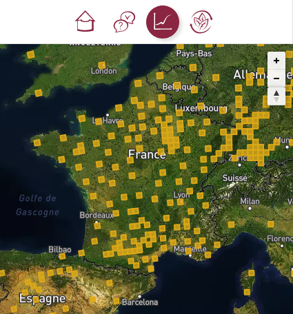
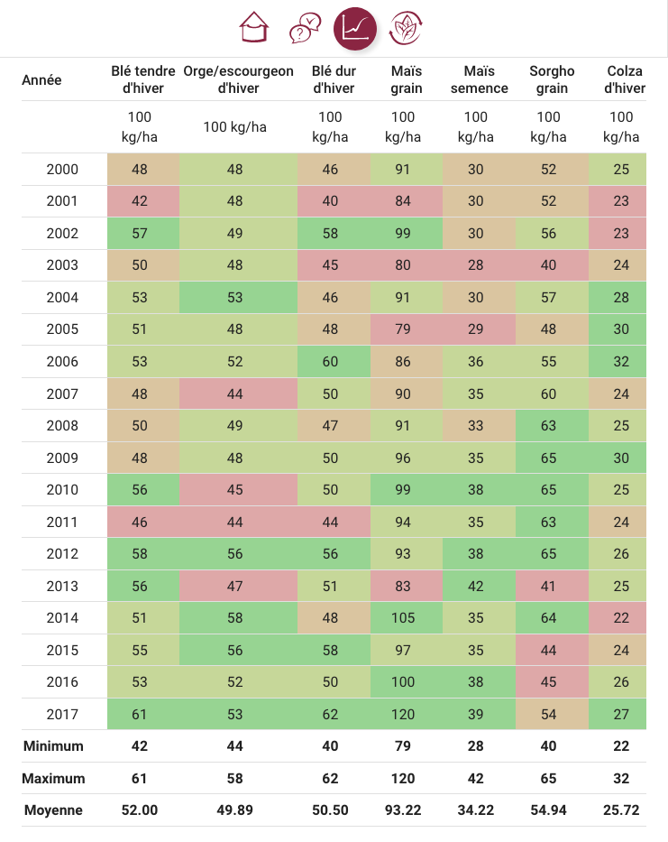
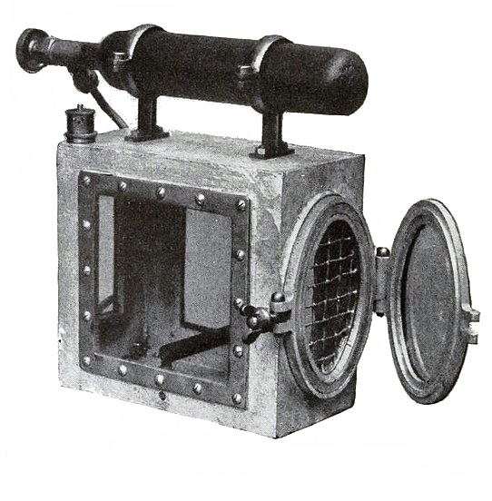
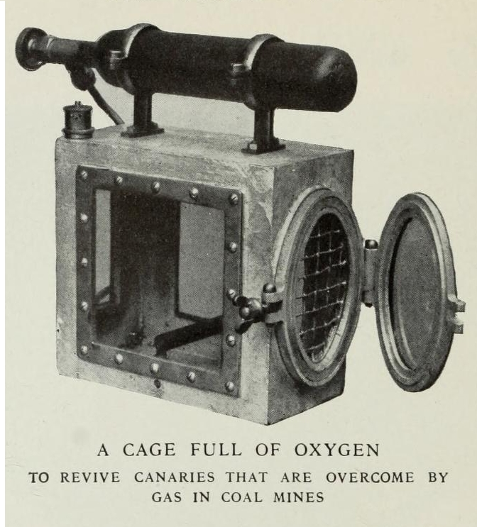
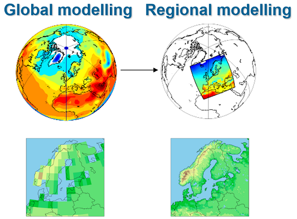
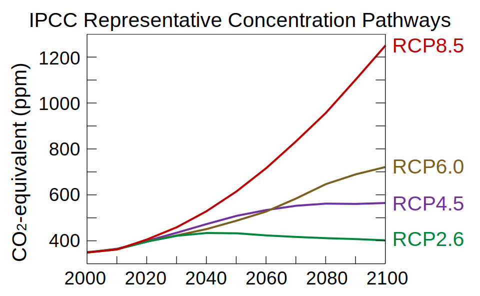
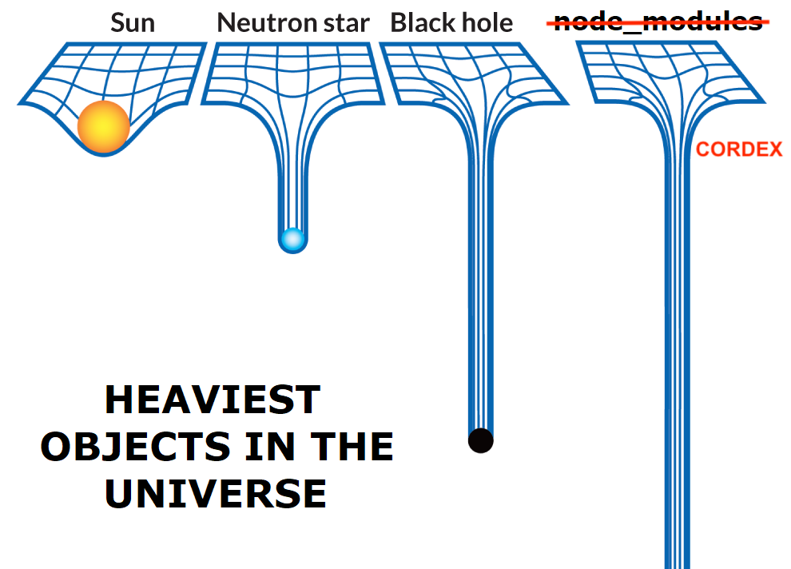
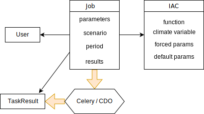
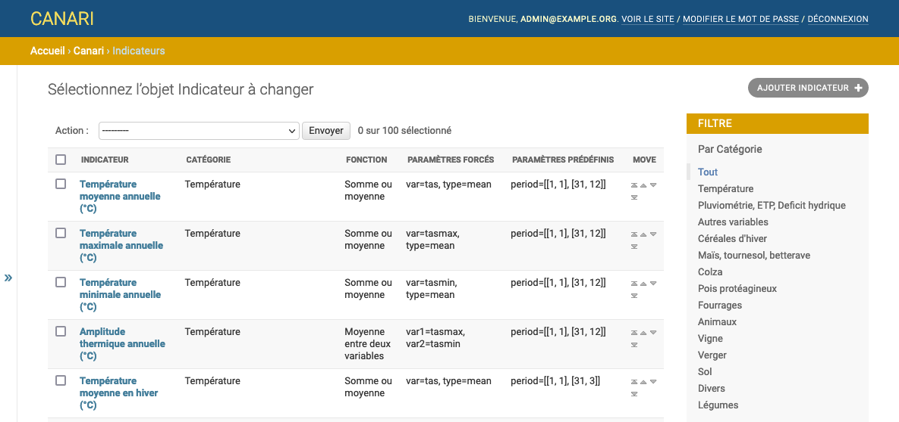
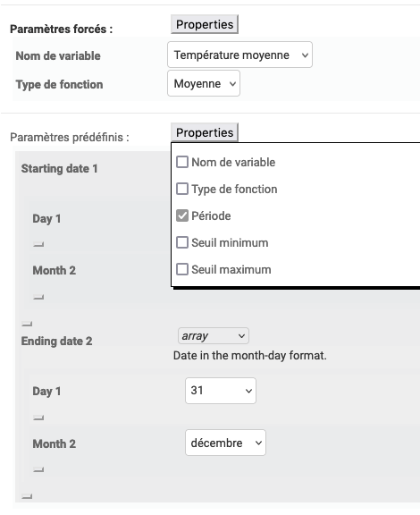

<!--  -->

<!-- .slide: class="alternate" data-background-image="fonds/couv.jpg" -->

# Lutter contre le dérèglement climatique avec Django

---

## Qui suis-je ?

> Sébastien Corbin (@SebCorbin)

- Python/Django depuis 2016
- full-stack, auparavant PHP/Drupal, 10+ ans d'XP dans le web
- blog pas à jour depuis 10 ans

---

## Pour qui je roule ?

> Makina Corpus <https://makina-corpus.com/>

- Toulouse et Nantes
- Python et PHP (apps métiers, SIG, data science & IA)
- Front-end/UX
- Audits et Formations
- Open-source dans l'âme

Sponsor argent de cette PyConfr !🥈

---

## Avec qui on bosse ?

 - des départements
 - des parcs naturels
 - des associations
 - des fédérations
 - etc.

Mais aussi des clients privés

---

## Un sujet qui nous parle

<div style="display: flex;">
<div style="flex: 1 1 0">


**Suivi de la qualité des analyses et prévisions océanographiques**

 -  React, Redux, Router
 -  PlotlyJS
 -  PostgreSQL, PostGIS
 -  Django REST Framework

</div>

<div style="flex: 1 1 0">


**Amélioration du Metocean Analytics**

- Django
- Tuiles vectorielles
- Utilery
- Fiona et Shapely
- Mapbox GL JS
- Turf.js
</div>

<div style="flex: 1 1 0">


**Plateforme de mise en relation des CUMA**

- Django
- PostgreSQL
- Angular
- Docker

</div>
</div>

Notes:
CUMA = coopérative d'utilisation de matériel agricole

---

## Solagro

Association française pour des transitions énergétique, agroécologique et alimentaire

- accompagne les agriculteurs et les coopératives
- formations
- programmes européens de recherche
- outils pour aider du projet individuel aux politiques publiques européennes


Notes:
Solagro est une association française qui vise à favoriser l'émergence et le développement, 
dans les domaines de l'énergie, de l'environnement, de l'agriculture et de la forêt, de pratiques 
et de procédés participant à une gestion économe, solidaire et de long terme des ressources naturelles. 

---

> Le secteur agricole est particulièrement vulnérable au changement climatique

> S'adapter est une nécessité

> Besoin de données “agro-climatiques” robustes pour décider

Notes:
Le secteur agricole est particulièrement vulnérable au changement climatique, vous prendrez pour preuve les dernières actualités autour 
de l'état des nappes phréatiques, des secheresse quasi-annuelles, des tempetes/inondations.


---

## L'existant

Un fichier Excel de 129Mo, pour un lieu donné (1 par adhérent de Solagro participant au projet), comprenant :

 - un historique de rendement des cultures
 - des données climatiques 
     - précipitations, 
     - températures minimales
     - températures moyennes
     - vitesse du vent
     - etc.
 - des indicateurs agro-climatiques (IAC)
 - des graphiques montrant l'évolution

---
<!-- .slide: data-background-image="screens/screen_canari.png" -->
---
<!-- .slide: data-background-image="screens/screen_canari2.png" -->
---
<!-- .slide: data-background-image="screens/screen_canari3.png" -->
---
<!-- .slide: data-background-image="screens/screen_canari4.png" -->
---
<!-- .slide: data-background-image="screens/screen_canari5.png" -->
---

## Plateforme AWA - AgriAdapt

Objectif : sensibiliser au changement climatique en mettant en corélation des relevés de **rendement annuel de culture** avec des **observations du climat** passées et des projections climatiques

Le point de départ est l'excel précédent et chaque excel est ramené à un point de grille sur la carte.

Il y a également un quizz et l'app aborde les mesures pouvant être mises en place pour palier aux futurs enjeux.

---

<div style="display: flex"><div style="flex: 1">


</div>
<div style="flex: 1">


</div>
<div style="flex: 1">


</div></div>

---

<!-- .slide: class="alternate" data-background-image="fonds/couv.jpg" -->

# Le projet CANARI


---

## Définition

**C**limate **AN**alysis for **A**gricultural **R**ecommendations and **I**mpacts



---
<div class="r-stack">



 <!-- .element: class="fragment" -->

</div>

---

Une expression est rentrée dans le langage courant (anglophone) :

> climate canary

Fait référence aux espèces qui sont affectées par un danger environnemental avant les autres, permettant ainsi 
d'être un système d'avertissement pour les autres espèces vis-à-vis de ce danger.

C'est donc un synonyme d'indicateur environnemental.

Notes:
A la fin des années 1800, on utilisait des souris pour détecter les émanations de dioxyde de carbone et de méthane dans les mines.
Celles-ci montraient des problèmes respiratoires (quelques minutes) avant les mineurs (20 fois plus tard). On les a ensuite remplacées par des canaris vers 1911.
Les oiseaux étaient parfois conservés dans des supports auxquels étaient fixés de petites bouteilles d'oxygène pour les ranimer.
L'utilisation des canaris dans les mines britanniques a été progressivement abandonnée en 1986.

---

### L'objectif

L'idée est d'approfondir l'existant (plateforme AWA) pour cette fois-ci choisir le *point de grille* et les *indicateurs agro-climatiques* (IAC) que l'on souhaite visualiser.

- point de grille : il va falloir des données pour chaque, *beaucoup* de données
- indicateurs agro-climatiques : il va falloir les calculer à partir des données, sur de longues périodes, *très* longues

---

### Les données

- **GCM - RCM** : Global Climate Model (résolution 50km) / Regional (résolution ~12km)
- Euro-CORDEX : RCM pour l'europe



- RCP (4.5 et 8.5) : Scénarios établis par le GIEC



*Source : Wikipédia*

Notes:
GCM sont des données satellitaires et des projections en sont faites.
Pour passser à RCM il faut un changement d'échelle qui nécessite de débiaiser les données (corriger pour certaines parties du globe/ceratines variables)
RCP = Representative Concentration Pathway
4.5 et 8.5 sont exprimés en W/m<sup>2</sup> et représentent un forçage radiatif

---

<!-- .slide: class="items-stretch" -->

### Les simulations

<table style="font-size:.7em;white-space: nowrap">
    <thead class="bg-secondary">
    <tr>
      <th>Institution</th>
      <th>GCM</th>
      <th>RCM</th>
      <th>Ensemble</th>
      <th>Scénarios</th>
      <th>Période</th>
      <th>Variables</th>
    </tr>
    </thead>
    <tbody>
    <tr>
      <td>CLMcom</td>
      <td>MPI-M-MPI-ESM-LR</td>
      <td>CCLM4-8-17</td>
      <td>r1i1p1</td>
      <td rowspan="6" class="align-middle">4.5 et 8.5</td>
      <td rowspan="6" class="align-middle">1985 à 2100</td>
      <td>12</td>
    </tr>
    <tr>
      <td>SMHI</td>
      <td>ICHEC-EC-EARTH</td>
      <td>RCA4</td>
      <td>r12i1p1</td>
      <td>14</td>
    </tr>
    <tr>
      <td>CLMcom</td>
      <td>ICHEC-EC-EARTH</td>
      <td>CCLM4-8-17</td>
      <td>r12i1p1</td>
      <td>12</td>
    </tr>
    <tr>
      <td>KNMI</td>
      <td>ICHEC-EC-EARTH</td>
      <td>RACMO22E</td>
      <td>r1i1p1</td>
      <td>13</td>
    </tr>
    <tr>
      <td>SMHI</td>
      <td>IPSL-IPSL-CM5A-MR</td>
      <td>RCA4</td>
      <td>r1i1p1</td>
      <td>14</td>
    </tr>
    <tr>
      <td>DMI</td>
      <td>ICHEC-EC-EARTH</td>
      <td>KIRHAM5</td>
      <td>r3i1p1</td>
      <td>13</td>
    </tr>
    </tbody>
  </table>

L'_Institut Pierre-Simon Laplace_ (IPSL) nous ont bien aidé à comprendre tous ces jeux de données.

---

### Les variables 

- Précipitations
- Températures minimales, moyennes, maximales
- Vitesse du vent moyenne et maximale
- Evaporation
- Humidité
- etc.

---

## Donc résumons

On a :

- pour chaque point de grille (sur l'Europe)
- pour chaque jour, de 1971 à 2100
- pour 6 simulations
- pour deux scénarios
- 16 variables

4 To de fichiers NetCDF à manipuler pour nos calculs

---



---

## Heureusement il y a des gens plus intelligents que nous

> CDO (Climate Data Operator)

Optimisé pour le calcul parallèle et l'extraction des données de fichiers NetCDF

Grâce à cet outil, on peut

- passer à une échelle plus petite (France)
- restreindre aux zones non marines
- reprojeter sur Mercator (EPSG:4326)
- harmoniser la résolution des différents fichiers
- retirer des variables inutiles (ruissellement, évaporation, etc.)
- convertir dans d'autres unités
- et bien sûr, réaliser des calculs

Au final : plus que 220Go

---

## Les indicateurs Agro-Climatique (IAC)

Formules, basées sur les variables précédentes, donnant une indication spécifique ou non à une culture.

Par exemple :

 - température moyenne
 - amplitude thermique
 - nombre de journées chaudes/froides (dépassant un seuil)
 - dernier jour de gel printannier (utile pour la vigne)
 - difficulté d'intervention mécanique
 - stress hydrique
 - pluie intense
 - etc.

Au total : 121 indicateurs configurables (au niveau des seuils/périodes)

---

## Les formules

- Somme ou moyenne
- Décompte
- Moyenne entre deux variables
- Quotient
- Date à partir de laquelle une limite est dépassée
- Dernier jour validant un seuil
- Premier jour validant un seuil
- Indice de Winkler
- Indice de Huglin
- Risque de stress thermique
- Déficit hydrique
- Séquence
- Réserve hydrique du sol

---
<!-- .slide: class="alternate" data-background-image="fonds/couv.jpg" -->

# La technique

---

## Le parcours utilisateur

- s'inscrit
- choisit un point de grille
- choisit une période et un scénario
- choisit un indicateur, le configure si besoin
- visualise les résultats

---

## Les choix techniques

- Django, parce que 💚
- Celery ou alternative, pour gérer une queue et lancer CDO
- Un front-end semi-découplé (VueJS) car on va avoir à gérer
  - une carte
  - une interface de choix d'indicateurs dynamique
  - des graphiques (avec Plotly)
- Bootstrap, parce que ce n'est pas le style qui compte

---

## Les modèles Django



---

## L'admin Django est votre amie

- Possibilité de différencier formulaire ajout/modification
  - permet de ne modifier que les params d'un IAC une fois la fonction et la variable choisies
- Possibilité de réordonner les IAC ou catégories d'IAC
  - intégration de `django-ordered-model` 



---

## L'admin Django est votre amie

- Possitibilité d'éditer des JSONField de façon fine
  - grâce au package `django-admin-json-editor` et un JSON schema form



---

### Intégration de VueJS

Un front "semi-découplé" avec `django-manifest-loader`

```html+django

```

```
├── frontend
│   ├── components
│   │   ├── charts
│   │   ├── form
│   │   ├── indicator
│   │   └── tables_synthesis
│   └── scss
└── src
    ├── account
    │   ├── migrations
    │   └── templates
    │       ├── account
    │       └── registration
    └── canari
        ├── management
        │   └── commands
        ├── migrations
        ├── settings
        │   └── instances
        ├── static
        │   ├── canari
        │   └── dist
        └── templates
            ├── admin
            └── pages
```

---

### Intégration de VueJS

- Compatibilité Typescript / SCSS
- Possibilité de faire plusieurs bundles, par ex
  - un pour la configuration d'un job (app)
  - un pour les graphiques de résultat (visualise)
- pas de routeur, juste un état global

---

### Problématiques rencontrées

- Temps de calcul
  - Des fichiers énormes -> SSD
  - Le multiprocessing de celery pas adapté à CDO -> loky au lieu de billiard
  - CDO génère des fichiers intermédiaires entre calculs -> les stocker en RAM
  - Le format NetCDF 3 est plus performant que NetCDF 4 avec CDO

Le temps de calcul est finalement passé de quelques minutes à moins d'une dizaine de secondes pour la plupart des fonctions

---

<!-- .slide: class="alternate" data-background-image="fonds/couv.jpg" -->

# On tente la démo ?

---

## Futur du projet

- Financement initial par l'ADEME et ministère de l'Agriculture
- Passage à l'échelle de l'Europe avec des financements espagnols, allemands et estoniens
- Traduction de l'interface en 5 langues
- Améliorations de l'UX

---

<!-- .slide: class="alternate" data-background-image="fonds/couv.jpg" -->

# Merci !

## Questions ?

On recrute ! <https://makina-corpus.com/rejoignez-nous>

<!--  -->
